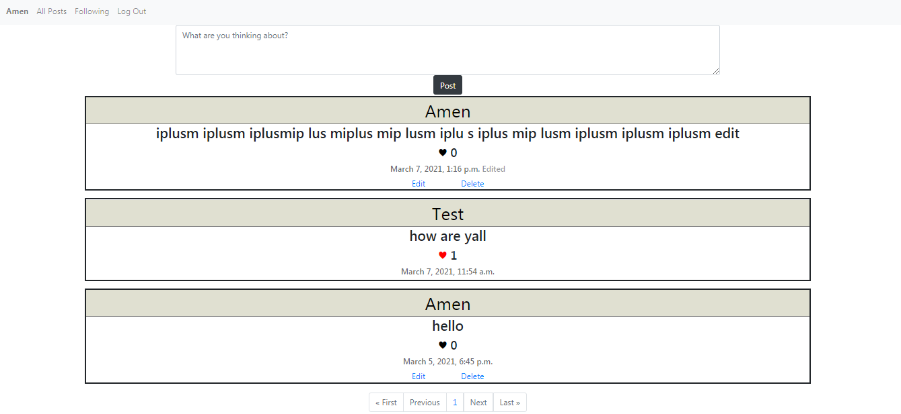

# Network

> Home page with a liked post

---

## Description

 Network is a Twitter-like social network website which users post and interact with posts. Registered users can follow others users, like posts, and edit and delete his own post. Unregistered users can only read posts.

#### What i have used

- HTML
- Css
- Python
- Ajax
- Django
- Bootstrap

[Back To The Top](#network)

---

## How To Use

- ### Posting
  It's very simple to write a post, user just need to write the text he wants to post in the `What are you thinking about?` box, and clicking on `post`, that's it!

- ### Home

  In the *Home* page user is able to see all posts. Every single posts shows four things: **username**, **post content**, **date**, **likes**

  - When user clicks on:

    - `username`: he will get redirected to this user profile.

    - `heart`: the heart stand for the **like** button, the original color is black, when liking a post the heart will turn *red*, and the *Likes number* will increase immediately.

- ### Profile
  The profile shows all posts of a specific user only, and the number of his *followers*, *followings* and *posts*. Other users can *follow* him by clicking on `Follow` button.

- ### Followings
  The followings tab in the navbar shows posts from people user has followed only.

- ### Edit and Delete
    - User can **Delete** his own post by clicking on the `Delete` button in his post. A confirmation page will be shown if user really want to delete post or not.

    - User can **Edit** his own post by clicking on the `Edit` button in his post. After editing a post, an **edited** word will appear on this post so people can know that this post was edited.

[Back To The Top](#network)

---
