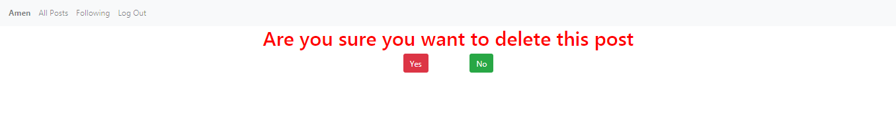
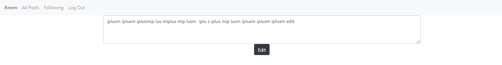
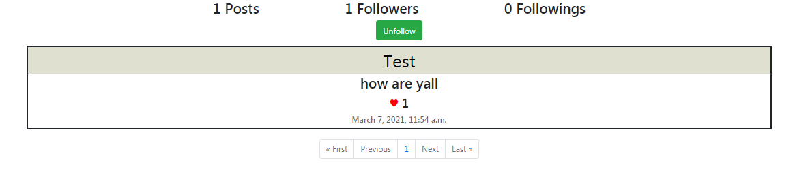

# network
I designed a Twitter-like social network website for making posts and following users.
After the user login/register the home page will shown *All Posts*   
User can type in the the box *What are you thinking about* to add a post, he will see all posts *(username, post content, date, like numbers)*, user is able to like/unlike posts, also edit and delete his own posts, a confirmation page will appear if user tried to delete his own post, and *edited* word will appear on edited post  
   
If user clicked on the *username* in the post he will be redirected to the same user profile  
  
User can see numbers of followers, followings and number of posts that has been uploaded, also he can follow/unfollow other users.  
The *Following* tab in the navbar will show the user posts from people he follows only.
